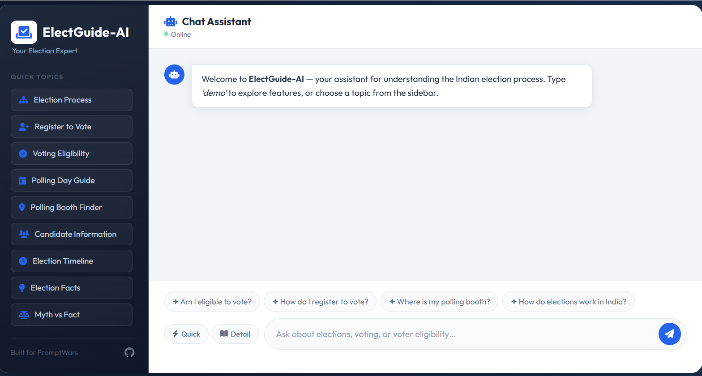
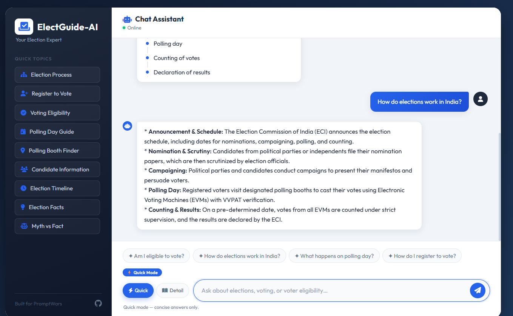
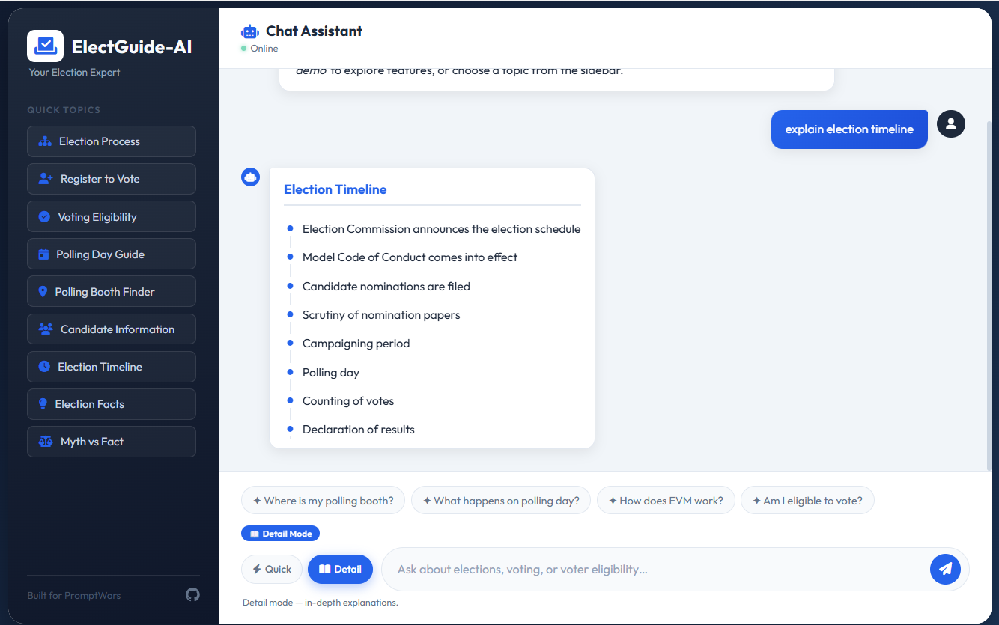
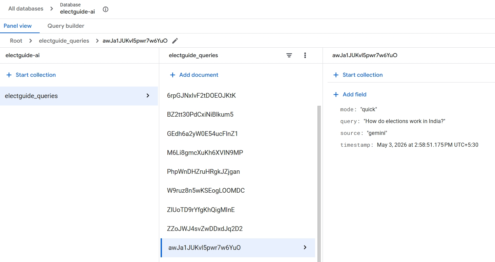

# ElectGuide-AI

> An AI-powered civic assistant that helps citizens understand the Indian election process, voting eligibility, and polling procedures through an interactive conversational interface.

[](https://electguide-ai-1000034027511.asia-south1.run.app/)
[](https://nodejs.org/)
[](https://ai.google.dev/)
[](https://cloud.google.com/run)

---

## Live Demo

ElectGuide-AI is deployed on Google Cloud Run and is publicly accessible:

🔗 **https://electguide-ai-1000034027511.asia-south1.run.app/**

---

## Problem Statement

Many citizens lack clear knowledge about election procedures, voter eligibility, and voting preparation. ElectGuide-AI addresses this gap by providing an accessible assistant that explains the election process, guides voters through preparation steps, and answers common election-related questions — all through a simple chat interface.

---

## Screenshots

<table>
  <tr>
    <td align="center" width="50%">
      <b>1. Main Interface</b><br/>
      <sub>Dark sidebar, suggestion prompts &amp; topic navigation</sub><br/><br/>
      
    </td>
    <td align="center" width="50%">
      <b>2. Quick Mode</b><br/>
      <sub><code>/quick</code> — concise, straight-to-the-point answers</sub><br/><br/>
      
    </td>
  </tr>
  <tr>
    <td align="center" width="50%">
      <b>3. Detail Mode</b><br/>
      <sub><code>/detail</code> — expanded, step-by-step explanations</sub><br/><br/>
      
    </td>
    <td align="center" width="50%">
      <b>4. Firestore Analytics</b><br/>
      <sub>Query logs with mode, source &amp; timestamp</sub><br/><br/>
      
    </td>
  </tr>
</table>

---

## Features

| Feature | Description |
|---|---|
| **Election Process Guide** | Step-by-step walkthrough of how Indian elections work |
| **Voting Preparation Guide** | Pre-polling checklist for first-time voters |
| **Polling Day Explanation** | What to expect when you arrive at the booth |
| **Voter Eligibility Checker** | Checks age, citizenship, and registration status |
| **Polling Booth Finder Guidance** | Explains how to locate your assigned polling station |
| **Candidate Information Lookup** | Guides users on how to research candidates in their constituency |
| **Election Timeline Visualization** | Visual breakdown of each stage of an election |
| **Election FAQ Responses** | Covers NOTA, EVMs, VVPAT, MCC, vote counting, and more |
| **Election Facts Generator** | Provides educational facts about Indian elections |
| **Myth vs Fact Education** | Corrects common misconceptions about voting |
| **Quick / Detail Response Modes** | `/quick` for concise answers, `/detail` for in-depth explanations |
| **Context-Aware Conversation** | Maintains the last 2 exchanges for accurate follow-up handling |
| **Lightweight RAG Retrieval** | Retrieves relevant knowledge from the local JSON base before calling AI |
| **Firestore Interaction Analytics** | Logs every query with mode, source, and timestamp for usage insights |
| **Modern Lightweight UI** | Responsive chat interface with animated messages and suggestion prompts |

---

## AI Model

ElectGuide-AI integrates Google's **Gemini API** for generating explanations when a query falls outside the local intent engine.

**Model used:**
```
gemini-2.5-flash
```

The assistant prioritises deterministic responses from its knowledge modules and only calls Gemini when necessary. This hybrid approach ensures:

- ⚡ Fast responses for common queries
- 💰 Reduced API usage and cost
- ✅ Reliable information grounded in the structured knowledge base

---

## Architecture / How it works

The assistant uses a **hybrid architecture** combining rule-based logic and AI reasoning:

```
User
 ↓
Chat Interface (Vanilla HTML / CSS / JS)
 ↓
Chat Controller (Express)
 ↓
Intent Engine  ──────────────────────────── (deterministic responses)
 ↓
Knowledge Retrieval (JSON-based RAG)  ────── (structured election data)
 ↓
Gemini AI Fallback  ─────────────────────── (complex / unmatched queries)
 ↓
Response returned to User
 ↓
Firestore Analytics Logging
```

---

## Google Cloud Integration

ElectGuide-AI leverages multiple Google Cloud services:

| Service | Usage |
|---|---|
| **Google Gemini API** | AI-powered explanations for complex queries |
| **Cloud Run** | Serverless, scalable container deployment |
| **Firestore** | Interaction analytics and query logging |
| **Cloud Logging** | Application-level monitoring and diagnostics |

### Firestore Schema

Each interaction record stores:

| Field | Description |
|---|---|
| `query` | The user's message |
| `mode` | Response mode — `quick`, `detail`, or `normal` |
| `source` | Response origin — `intent` (local) or `gemini` (AI) |
| `timestamp` | UTC timestamp of the interaction |

---

## Tech Stack

| Layer | Technology |
|---|---|
| Frontend | Vanilla HTML, CSS, JavaScript |
| Backend | Node.js + Express |
| AI Integration | Google Gemini REST API (`gemini-2.5-flash`) |
| Knowledge Base | JSON-structured election data |
| Analytics Logging | Firestore |
| Deployment | Google Cloud Run |
| Containerisation | Docker (Alpine-based) |

---

## Example Demo Prompts

Try these in the chat interface to explore the assistant:

```
demo
how elections work in India
how do I register to vote
am I eligible to vote if I am 20
where is my polling booth
show election timeline
fact
can someone vote twice
```

### Response Mode Prefixes

| Prefix | Behaviour |
|---|---|
| `/quick` | Returns a concise, single-paragraph answer |
| `/detail` | Returns an in-depth, step-by-step explanation |

**Examples:**
```
/quick What is an EVM machine ?
/detail explain election timeline
```

---

## Running Locally

**1. Install dependencies:**

```bash
npm install
```

**2. Configure environment (optional — enables AI fallback):**

```bash
cp .env.example .env
# Add your GEMINI_API_KEY to .env
```

**3. Start the server:**

```bash
npm start
```

**4. Open in your browser:**

```
http://localhost:8080
```

> **Note:** The assistant works fully without a Gemini API key using its built-in intent engine. Queries outside the knowledge base will show a graceful fallback message until the key is configured.

---

## Environment Variables

| Variable | Required | Description |
|---|---|---|
| `GEMINI_API_KEY` | Optional | Google Gemini API key for AI fallback responses |
| `PORT` | Optional | Port to listen on (default: `8080`) |

---

## Running Tests

```bash
npm test
```

The test suite covers **24 test cases** including:

- Election timeline intent detection
- Polling booth finder intent
- Candidate information intent
- Voter eligibility checker — general, underage, eligible, and unregistered cases
- FAQ responses — NOTA, VVPAT, vote counting, EVM
- Voting preparation and polling day process intents
- Follow-up context queries — generic and step-specific
- Demo and help commands
- Election facts command
- Unmatched query handling

---

## Deployment (Google Cloud Run)

**Step 1 — Build and push the container image:**

```bash
gcloud builds submit --tag gcr.io/PROJECT_ID/electguide-ai
```

**Step 2 — Deploy to Cloud Run:**

```bash
gcloud run deploy electguide-ai \
  --image gcr.io/PROJECT_ID/electguide-ai \
  --platform managed \
  --region asia-south1 \
  --allow-unauthenticated \
  --set-env-vars GEMINI_API_KEY=YOUR_KEY
```

Replace `PROJECT_ID` with your Google Cloud project ID and `YOUR_KEY` with your Gemini API key.

The service listens on `process.env.PORT`, which Cloud Run injects automatically (defaulting to `8080`).

---

## Repository Structure

```
electguide-ai/
│
├── public/
│   ├── index.html              # Chat UI
│   ├── style.css               # Styles and animations
│   └── script.js               # Frontend logic, typing effect, suggestion prompts
│
├── src/
│   ├── controllers/
│   │   └── chat.controller.js  # Request handler + conversation context memory
│   ├── routes/
│   │   └── chat.routes.js      # Express router
│   ├── services/
│   │   ├── intent.service.js   # Intent detection + voter eligibility checker
│   │   ├── gemini.service.js   # Gemini REST API fallback
│   │   └── analytics.service.js # Firestore interaction logging
│   └── data/
│       └── election_knowledge.json  # Local structured knowledge base
│
├── tests/
│   └── intent.test.js          # 24 automated test assertions
│
├── docs/
│   └── screenshots/            # README screenshots
│       ├── main-interface.png
│       ├── quick-mode.png
│       ├── detail-mode.png
│       └── firestore-analytics.png
│
├── Dockerfile
├── .dockerignore
├── .gitignore
├── .env.example
├── package.json
└── README.md
```

---

## Repository Constraints

This project intentionally uses a lightweight architecture to stay within the **10 MB repository size limit** required for the challenge:

- No React, Vue, or frontend frameworks
- No UI component libraries
- No heavy build tooling
- All styling is vanilla CSS
- `node_modules` is excluded from the repository
- JSON-based knowledge retrieval instead of large vector databases

---

## Future Improvements

- **Multilingual Support**: Add support for regional Indian languages (Hindi, Bengali, Tamil, etc.).
- **Voice Input**: Enable voice commands for users less comfortable with typing.
- **Real-Time Data**: Integrate live election results and candidate data during polling phases.

## Project Goal

ElectGuide-AI demonstrates how a **lightweight AI system** can combine structured knowledge, conversational reasoning, and cloud infrastructure to create an accessible civic education tool — making election information available to every citizen, simply and reliably.
